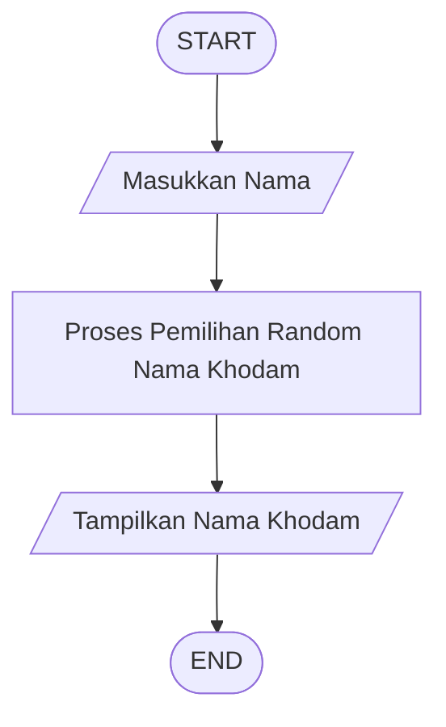

# **Program Cek Khodam**

Program yang kami buat (kelompok 4) ini memiliki beberapa kegunaan, yaitu yang pertama, sebagai hiburan semata untuk membantu para pengguna yang sedang merasa bosan menjadi terhibur melalui hasil cek yang bersifat acak dan lucu. Selain itu, program ini juga dapat memberikan motivasi ringan sehingga dapat menambah semangat pengguna. 

Fitur Utama : 
1. Import random : Mengambil data secara acak menggunakan random.choice()
2. menggunakan def (fungsi) cek_khodam
3. List Khodam untuk di pilih secara random
4. dapat Motivasi dari setiap khodam yang didapat
5. menggunakan sistem random khodam
6. pencocokan motivasi dengan khodam yang didapat
7. Menggunakan format f string
8. Input nama
9. print hasil
    

Panduan Instalasi:
1. Sebelum memulai, pastikan perangkat Anda sudah memenuhi syarat berikut:
    1. Sistem Operasi: Windows / Linux / macOS
    2. Python versi 3.8 atau lebih baru
    3. Koneksi internet (untuk mengunduh dari GitHub)
3. Instalasi Python:
    1. Kunjungi situs resmi Python: https://www.python.org/downloads/
    2. Pilih versi yang sesuai dengan sistem operasi Anda
    3. Install Python dan centang opsi “Add Python to PATH” saat instalasi
4. Download Projek:
    1. Jika Anda sudah memiliki Git:
       1. jalankan perintah berikut pada Command Prompt / Terminal: git clone https://github.com/rexabhinaya/Proyek-Program-Cek-Khodam
       2. Masuk ke direktori project: cd Proyek-Program-Cek-Khodam
    3. Jika tidak memiliki Git (download ZIP):
       1. Buka repository ini di GitHub
       2. Klik tombol Code → Download ZIP
       3. Ekstrak file ke dalam folder yang Anda inginkan
    
    #Program ini hanya menggunakan modul bawaan Python:random (Sehingga tidak perlu instalasi library tambahan)'
    

Panduan Menjalankan:

Sebelum kamu mulai menjalankan program cek khodam ini, pastikan kamu sudah menyiapkan file programnya. Setelah siap, kamu bisa memilih mau menjalankannya lewat Visual Studio Code atau langsung lewat Terminal. Berikut panduannya:
1. Menjalankan dengan Visual Studio Code
    1. Buka aplikasi Visual Studio Code.
    2. Buat file baru, lalu salin seluruh isi program ke dalamnya.
    3. Simpan file tersebut dengan nama “cek_khodam.py”.
    4. Pastikan Python sudah terpasang di laptop, lalu pilih interpreter Python melalui menu pencarian di VSC (biasanya muncul dengan nama Python 3).
    5. Setelah itu, jalankan program. Kamu bisa melakukannya dengan menekan tombol “Run” yang biasanya ada di pojok kanan atas, atau melalui terminal bawaan VSC.
    6. Saat program meminta nama, cukup ketik nama kamu lalu tekan Enter. Program akan menampilkan khodam dan pesan motivasinya.

2. Menjalankan dengan Terminal (CMD / PowerShell / Terminal Linux)
    1. Buka aplikasi editor teks apa pun, lalu tempelkan isi program ke dalamnya.
    2. Simpan file tersebut dengan nama “cek_khodam.py”.
    3. Buka terminal di perangkatmu.
    4. Arahkan terminal ke folder tempat file program disimpan.
    5. Jalankan file tersebut.
    6. Begitu terminal meminta nama, masukkan nama kamu. Setelah itu, hasil khodam beserta pesannya akan muncul.   

### **Penjelasan:**

### **1. START**
Program dimulai dan siap menerima input dari pengguna.

### **2. Masukkan Nama**
Pengguna memasukkan nama yang akan dicek khodam-nya melalui fungsi `input()`.

### **3. Pemilihan Random Nama Khodam**
Program mengambil satu khodam secara acak dari list `daftar_khodam` menggunakan `random.choice()`.

### **4. Tampilkan Nama Khodam**
Program menampilkan:
- Nama khodam yang terpilih
- Pesan motivasi dari khodam tersebut

### **5. END**
Program selesai setelah hasil ditampilkan.

Daftar Kontributor (Tabel): 

